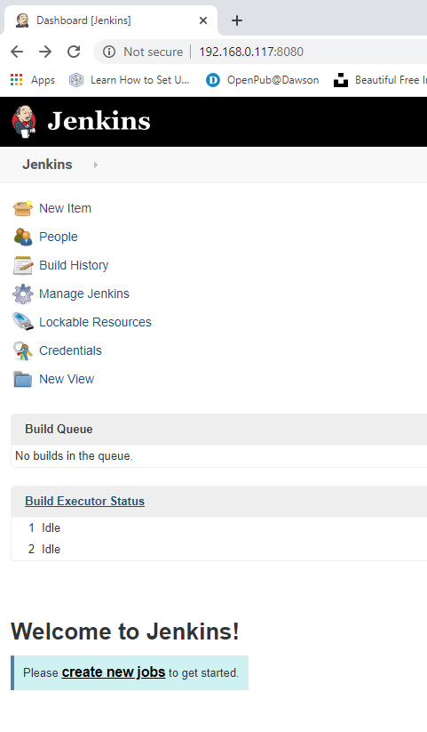
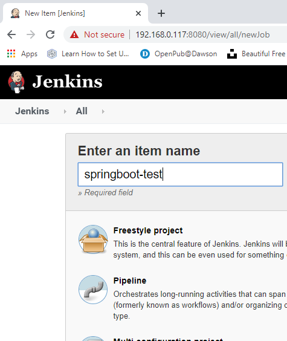
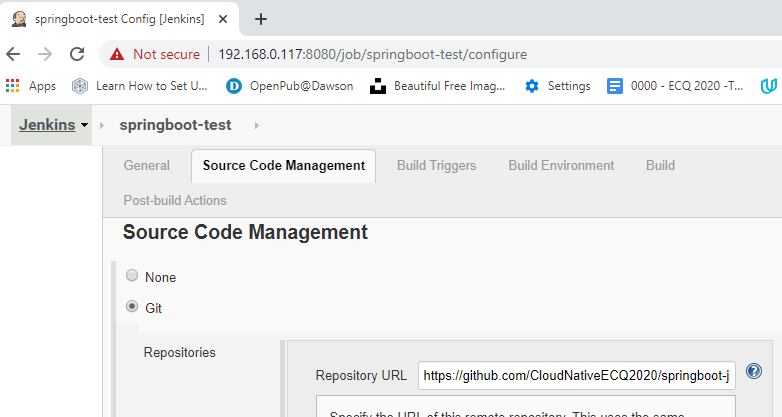
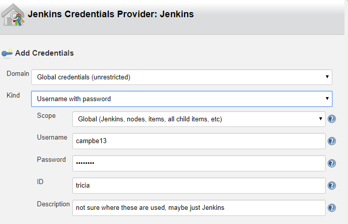
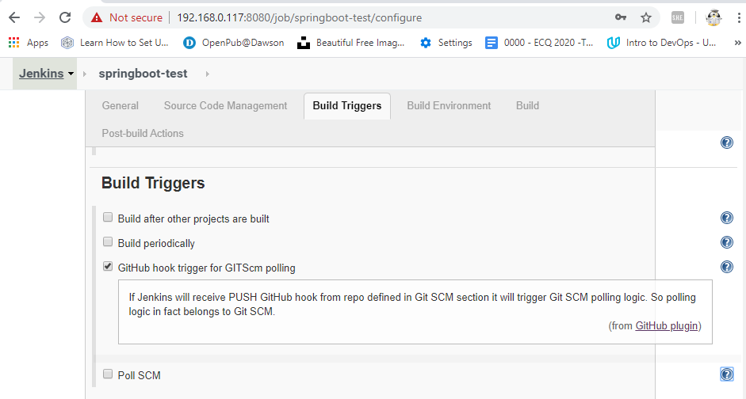
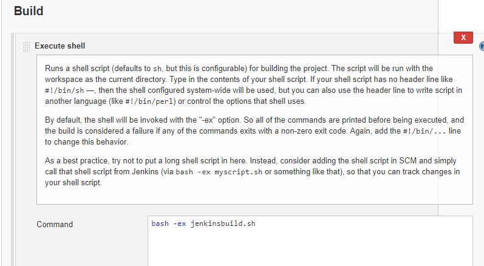
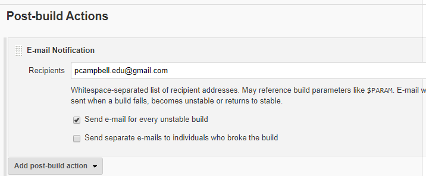

# ci/cd using jenkins 

Jenkins listens by default on port 8080

Following https://dzone.com/articles/learn-how-to-setup-a-cicd-pipeline-from-scratch
1. [start jenkins](#start-jenkins-service)
1. [set up pipeline](#set-up-pipeline)


original test
1. [load jenkins port 8080](#load-jenkins)
1. [create a project w jenkins](#create-&-configure-project)

## start jenkins service
First `systemctl start jenkins`
```
tricia@acerubuntu1804:~/ecq/springboot-java$ systemctl status jenkins
● jenkins.service - LSB: Start Jenkins at boot time
   Loaded: loaded (/etc/init.d/jenkins; generated)
   Active: active (exited) since Fri 2020-05-01 21:34:44 EDT; 4 days ago
     Docs: man:systemd-sysv-generator(8)
    Tasks: 0 (limit: 4597)
   CGroup: /system.slice/jenkins.service

May 01 21:34:15 acerubuntu1804 systemd[1]: Starting LSB: Start Jenkins at boot time...
May 01 21:34:40 acerubuntu1804 jenkins[1399]: Correct java version found
May 01 21:34:40 acerubuntu1804 jenkins[1399]:  * Starting Jenkins Automation Server jenkins
May 01 21:34:42 acerubuntu1804 su[1968]: Successful su for jenkins by root
May 01 21:34:42 acerubuntu1804 su[1968]: + ??? root:jenkins
May 01 21:34:42 acerubuntu1804 su[1968]: pam_unix(su:session): session opened for user jenkins by (uid=0)
May 01 21:34:44 acerubuntu1804 jenkins[1399]:    ...done.
May 01 21:34:44 acerubuntu1804 systemd[1]: Started LSB: Start Jenkins at boot time.
```
## set up pipeline
1. load the web page
2. set up build for the app (maven)   `springboot-1-build`
     1. repo https://github.com/CloudNativeECQ2020/springboot-java-jenkins.git
     2. set up github creds (not sure where used
     3. tested build, works  (run build on project page
3.  set up trigger for the build (GIT scm trigger)  (webhook)  https://developer.github.com/webhooks/
     1. Go to your project repository.
     2. Go to "settings" in the right corner.
     3. Click on "webhooks."
     4. Click "Add webhooks."
     5. stopping here, need to move jenkins to korra (?) so that it can be accessed by github via url  todo see [jenkins on korra](jenkinsonkorra.md)
     
# original test
## load jenkins
load the web page

## create & configure project 
create the project (freestyle)

set up the git repo (must use https)
todo check if there is a jenkins plugin to use ssh repo url

add git credentials https://www.jenkins.io/doc/book/using/using-credentials/ & https://plugins.jenkins.io/credentials/ & https://github.com/jenkinsci/credentials-plugin/blob/master/docs/user.adoc

set build triggers

build script [jenkinsbuild.sh](jenkinsbuild.sh)
__note__ I had to add userid jenkins to the group docker (& restart the service)
```
tricia@acerubuntu1804:~/ecq/springboot-java$ sudo usermod jenkins -G docker
[sudo] password for tricia:
tricia@acerubuntu1804:~/ecq/springboot-java$ grep jenkins /etc/group
docker:x:999:tricia,dockert,jenkins
jenkins:x:132:
tricia@acerubuntu1804:~/ecq/springboot-java$ id jenkins
uid=127(jenkins) gid=132(jenkins) groups=132(jenkins),999(docker)
```


set post build action  (email, needs to be local as system is not set to use an smtp relay/server)
todo set up ubuntu to use google as an smtp relay / server (sendmail or postfix)  for jenkins

set up a trigger to jenkins on github


